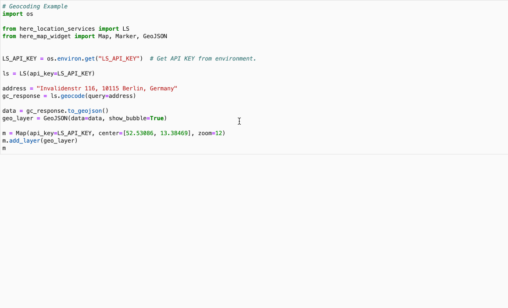

# HERE Location Services for Python

This library provides a pure Python interface over [HERE Location Services](https://developer.here.com/documentation/geocoding-search-api/dev_guide/index.html)
REST APIs. HERE exposes [REST APIs](https://developer.here.com/documentation) and this library makes it even easier to use those APIs for
Python developers, data scientists and data analysts.

The GIF below shows a basic example of a geocoding service.
# 

## Prerequisites

Before you can install this package, run its test-suite, or open a sample notebook using it you need to make sure you meet the following prerequisites:

- A Python installation, 3.6+ recommended, with the `pip` command available to install dependencies.
- A HERE developer account, freely available under [HERE Developer Portal](https://developer.here.com).
- A Location Services API key from the [HERE Developer Portal](https://developer.here.com/) under the `projects` section in your profile, in an environment variable named `LS_API_KEY` which you can set like this (with a valid value, of course):
  ```bash
  export LS_API_KEY="MY-LS-API-KEY"
  ```
  
## Installation

This package can be installed with `pip` from various sources. For now only the first is recommended:

- Install from [PyPI](https://pypi.org/):
  ```bash
    pip install here-location-services
  ```

- Install from GitHub:
  ```bash
  pip install -e git+https://github.com/heremaps/here-location-services-python#egg=here-location-services
  ```

If you want to run the test suite or experiment with the sample notebooks bundled you need to clone the whole repository:

- Make a local clone of the repository hosting this package. The following command should do:
  ```bash
  git clone https://github.com/heremaps/here-location-services-python.git
  ```
- Change into the repo root directory:
  ```bash
  cd here-location-services-python
  ```

## Run Test Suite

To run the test suite you can do this locally, which should provide a test coverage of 100%:

```bash
pip install -r requirements_dev.txt
pytest -v --cov=here_location_services tests
```

## Documentation

For now documentation consists of sample notebooks in `docs/notebooks` directory.

Run below commands to build the docs locally in the `docs/source` directory of the cloned repository.

```bash
pip install -e .
pip install -r requirements_dev.txt
sh scripts/build_docs.sh
```

## Hello World Example
This is a tiny "Hello World" like example that you can run to get geocoding 
for a given address right away! Just make sure to use your own real API key!

```python
import json
import os

from here_location_services import LS


LS_API_KEY = os.environ.get("LS_API_KEY")  # Get API KEY from environment.
ls = LS(api_key=LS_API_KEY)

address = "Invalidenstr 116, 10115 Berlin, Germany"
geo = ls.geocode(query=address)
print(json.dumps(geo.to_geojson(), indent=2, sort_keys=True))
```

# License
Copyright (C) 2019-2020 HERE Europe B.V.

See the [License](LICENSE) file in the root of this project for license details.

